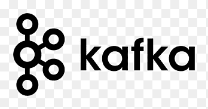

<div id="top"></div>


<!-- PROJECT SHIELDS -->
[![MIT License][license-shield]][license-url]
[![LinkedIn][linkedin-shield]][linkedin-url]


<!-- PROJECT LOGO -->
<br />
<div align="center">
  <a href="https://github.com/othneildrew/Best-README-Template">
    
  </a>

  <h3 align="center">Apache Kafka Summary</h3>

  <p align="center">
    This repository is dedicated to providing comprehensive information about Apache Kafka, including its core concepts, configuration, and best practices for personal study.
    <br />
    <a href="https://github.com/othneildrew/Best-README-Template"><strong>Explore the docs »</strong></a>
    <br />
  </p>
</div>


<!-- TABLE OF CONTENTS -->
<details>
  <summary>Table of Contents</summary>
  <ol>
    <li>
      <a href="#about-the-project">About The Repository</a>
      <ul>
        <li><a href="#built-with">Built With</a></li>
      </ul>
    </li>
    <li>
      <a href="#getting-started">Getting Started</a>
      <ul>
        <li><a href="#prerequisites">Prerequisites</a></li>
        <li><a href="#installation">Installation</a></li>
      </ul>
    </li>
    <li><a href="https://github.com/a-bianchi/kafka/blob/master/WHAT_IS_KAFKA_EN.md">What is apache Kafka?</a></li>
	<li><a href="https://github.com/a-bianchi/kafka/blob/master/WHAT_IS_KAFKA_ES.md">Que es apache Kafka?</a></li>
    <li><a href="#contact">Contact</a></li>
  </ol>
</details>


### Built With

* [Docker](https://www.docker.com/)
* [Makefile](https://www.gnu.org/software/make/manual/make.html)
* [Apache kafka](https://kafka.apache.org/)
* [Offset Explore](https://www.kafkatool.com/)

<p align="right">(<a href="#top">back to top</a>)</p>


<!-- GETTING STARTED -->
## Getting Started

To get started, the only requirement is Docker if you want to run Kafka in containers.

## Prerequisites

Before getting started, ensure you have the following tools installed on your system:

### Docker
- Docker is required to run the Kafka and Zookeeper services in containers.
- Installation guide: [Docker Install Documentation](https://docs.docker.com/get-docker/)

### Docker Compose
- Docker Compose is used to define and manage multi-container Docker applications.
- Installation guide: [Docker Compose Install Documentation](https://docs.docker.com/compose/install/)

### Make
- Make is a build automation tool used to manage the build process for projects through a `Makefile`.
- Installation guide:
    - For macOS: `brew install make`
    - For Linux: `sudo apt-get install make`
    - For Windows: Install via [Chocolatey](https://chocolatey.org/packages/make) or [Make for Windows](http://gnuwin32.sourceforge.net/packages/make.htm)


### Installation

_Below is an example of how you can instruct your audience on installing and setting up your app. This template doesn't rely on any external dependencies or services._

1. Get a free API Key at [https://example.com](https://example.com)
2. Clone the repo
   ```sh
   git clone https://github.com/your_username_/Project-Name.git
   ```
3. Install NPM packages
   ```sh
   npm install
   ```
4. Enter your API in `config.js`
   ```js
   const API_KEY = 'ENTER YOUR API';
   ```

<p align="right">(<a href="#top">back to top</a>)</p>


<!-- USAGE EXAMPLES -->
## Usage

Use this space to show useful examples of how a project can be used. Additional screenshots, code examples and demos work well in this space. You may also link to more resources.

_For more examples, please refer to the [Documentation](https://example.com)_

<p align="right">(<a href="#top">back to top</a>)</p>


<!-- LICENSE -->
## License

Distributed under the MIT License. See `LICENSE.txt` for more information.

<p align="right">(<a href="#top">back to top</a>)</p>


<!-- CONTACT -->
## Contact

Project Link: [https://github.com/a-bianchi/kafka](https://github.com/a-bianchi/kafka)

<p align="right">(<a href="#top">back to top</a>)</p>


<!-- MARKDOWN LINKS & IMAGES -->
[license-url]: https://github.com/a-bianchi/kafka/blob/master/LICENSE.txt
[linkedin-shield]: https://img.shields.io/badge/-LinkedIn-black.svg?style=for-the-badge&logo=linkedin&colorB=555
[linkedin-url]: https://linkedin.com/in/alejobianchi
[product-screenshot]: images/screenshot.png
